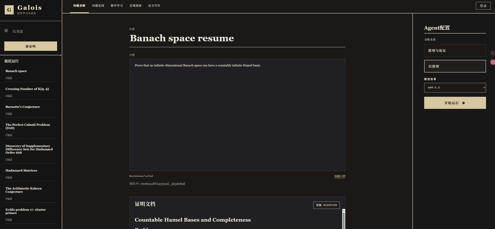

# Galois

Galois 是一个 Codex-first 的数学研究工作台。它把数学题目提交给 reasoning / verification agent，生成证明草图、校验报告、run 记录和 benchmark 产物。


## 功能示例



上图展示 Web workbench：左侧是最近运行，中央输入 Markdown/LaTeX 题目，右侧选择流程和模型，运行后展示证明文档与验证状态。

## 快速开始

```bash
uv sync
uv run galois web
```

打开终端输出的本地地址后，可以提交数学问题并查看 run 结果。

真实 reasoning / verification 需要配置模型环境变量：

```bash
export OPENAI_BASE_URL="..."
export OPENAI_API_KEY="..."
```

## 常用命令

```bash
uv run galois web
uv run galois suite list
uv run galois inspect <run_id_or_path>

uv run galois plan \
  --problem-id example \
  --problem-path three_horse/reasoning/data/example.md \
  --pipeline reasoning-verification

uv run galois launch \
  --problem-id example \
  --problem-path three_horse/reasoning/data/example.md \
  --pipeline reasoning-only
```

## 能力

- `reasoning-only`：生成自然语言证明草图并归档 `blueprint`。
- `reasoning-verification`：生成证明草图后调用 verification service，产出 verdict 和 repair hints。
- `web`：本地研究工作台，支持提交问题、轮询 run、查看 artifact。
- `suite`：管理 benchmark 示例集。
- `writing-only`：数学论文写作工作流，运行资产在 `three_horse/writing/`。

## 项目结构

```text
src/galois/      Python control plane
three_horse/     reasoning、verification、writing 运行资产
projects/        runs、logs、artifacts
benchmarks/      benchmark problems 和 manifests
configs/         默认配置
docs/            系统设计与计划文档
references/      只读上游参考快照
```

## 说明

- 默认 backend 是 `codex`，默认模型配置见 `configs/defaults.toml`。
- Problem Garden 使用 PostgreSQL；本地连接串可通过 `DATABASE_URL` 覆盖。
- 新核心逻辑放进 `src/galois/`

更多设计细节见 `docs/GALOIS_SYSTEM_DESIGN.md`。
